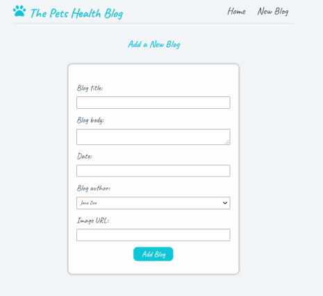

# React Blog App

This is a personal project I am working on while learning React. It is a simple blog within the topic of pets' health in which a user can switch to blog details upon clicking a blog preview, delete an existing blog and add a new blog.

Blog main page:


Form for creating a new blog:



The blog is created with:
- React (hooks, react router, react-icons)
- JavaScript
- JSON Server

## Setup

Clone this repo and run ``` $ npm install ``` to install all dependecies.

## Usage 

Once the dependencies are installed, you can run ```$ npm start ```  to start the application.

Open [http://localhost:3000](http://localhost:3000) to view it in the browser.

The page will reload if you make edits.\
You will also see any lint errors in the console.


